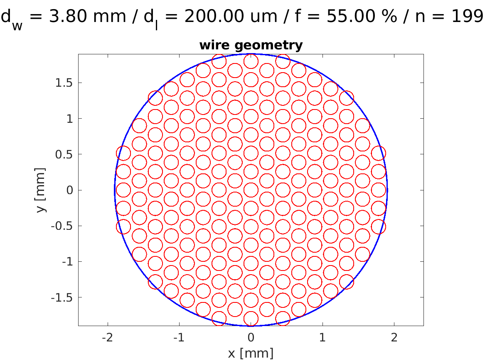
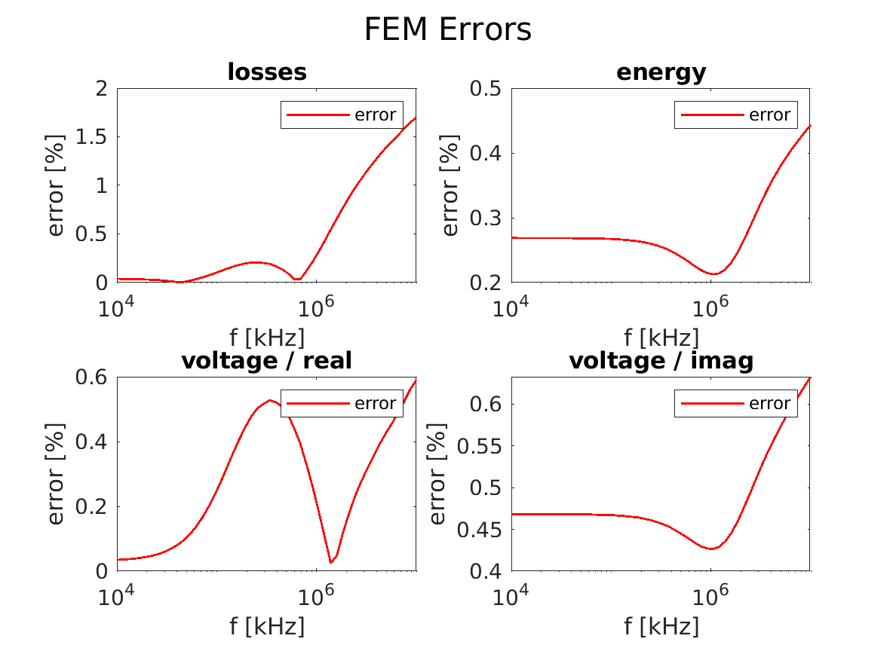

# Litz Wire Homogenization with COMSOL and MATLAB

This **COMSOL and MATLAB** tool extracts **homogenized material parameters for a litz wire**.
This means that a complex litz wire, which is composed of many strands, can be replaced with a homogeneous material.
This **virtual material parameters** are defined such that the energy and losses matches the stranded litz wire.
More concretely, a virtual **complex permeability** and **complex conductivity** are extracted.

The method features several advantages:
* A **reduced computational cost**, since the discrete strands are not modeled
* The **mesh** can be **coarse**, independent of the skin depth
* Method valid **up to several megahertz**
* The litz wire can feature **an arbitrary shape**
* The **impact of the eddy current** on the magnetic field is considered

The following limitations exist: 
* The litz wire is composed of round strands
* The litz wire is ideal (insulated and perfectly twisted strands)
* The litz wire is defined with a fill factor, the exact position of the strands is not considered

This tool is developed by the **Power Electronic Systems Laboratory at ETH Zurich** and is available under the **BSD License**. The code is also available on the ETH Data Archive.

## Example

A simple circular air coil realized with litz wire is considered:
* [run_1_homogenization.m](run_1_homogenization.m) - Extract the winding geometry, energy and field patterns from FEM
* [run_2_packing.m](run_2_packing.m) - Compute the geometry of a round litz wire
* [run_3_simulation.m](run_3_simulation.m) - Simulate with FEM a circulate litz wire coil (with and without homogenization)
* [run_4_plot.m](run_4_plot.m) - Plot the result (homogenization, geometry, and simulation)

This example compare two different methods:
* Simulation with the homogenized material parameters (fast)
* Simulation of all the discrete strands (slow)

The following parameters are extracted and compared:
* Energy
* Losses
* Induced voltage

The following conclusion are made:
* Both methods are equivalent (less than 2% deviation)
* The computation with homogenized parameters is much faster

### Homogenized Parameters and Wire Geometry

    
    

### Energy, Losses, And Induced Voltage

    
    

### Current Density: 10kHz and 10MHz

    
    

### Magnetic Field: 10kHz and 10MHz

    
    

## Compatibility

The tool is tested with the following MATLAB setup:
* Tested with MATLAB R2018b or 2019a
* No toolboxes are required.
* Compatibility with GNU Octave not tested but probably problematic.

The tool is tested with the following COMSOL setup:
* COMSOL Multiphysics 5.4 or 5.5
* AC/DC Module (for the magnetic simulation)
* MATLAB Livelink (for communication with MATLAB)

## References

References for the litz wire losses:
* Guillod, T. / Litz Wire Losses: Effects of Twisting Imperfections / 2017
* Meeker, D. / An Improved Continuum Skin and Proximity Effect Model for Hexagonally Packed Wires / 2012
* Xi, N. / An Equivalent Complex Permeability Model for Litz-Wire Windings / 2009

## Author

* **Thomas Guillod, ETH Zurich, Power Electronic Systems Laboratory** - [GitHub Profile](https://github.com/otvam)

## License

* This project is licensed under the **BSD License**, see [LICENSE.md](LICENSE.md).
* This project is copyrighted by: (c) 2016-2020, ETH Zurich, Power Electronic Systems Laboratory, T. Guillod.
